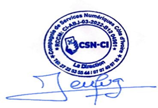

# CONTRAT DE PARTENARIAT BUSINESS DÉVELOPPEUR

**HUB_RESA — Plateforme Multi-Services de Réservation et de Gestion**

**Produit de :** Compagnie des Services Numériques (CSN)

**Gérant :** Monsieur Remi Keumingo

**Siège Social :** Abidjan Cocody Rivièra 2 Drogba, face au Groupe Scolaire André Malraux

**Contact :** +225 27 22 53 55 44 / +225 07 07 40 07 16 / +225 05 04 92 10 96

**Immatriculation :** Registre de Commerce et de Crédit Mobilier - Numéro CI-ABJ-03-2022-B12-04961

**Capital Social :** 10 000 000 FCFA

---

## PRÉAMBULE

Le présent contrat établit les conditions de partenariat entre **HUB_RESA** (ci-après « la Plateforme ») et un individu acceptant de devenir **Business Développeur** (ci-après « le Partenaire »). Ce contrat définit clairement le statut, les responsabilités, les commissions et les critères d'évolution professionnelle du Partenaire au sein de l'écosystème HUB_RESA.

---

## 1. STATUT ET NATURE DE LA RELATION

### 1.1 Statut Initial : Free-Lance

**Tous les Business Développeurs recrutés commencent avec le statut de Free-Lance.** Ce statut signifie que le Partenaire :

- Exerce son activité de manière indépendante et autonome
- N'est pas salarié de HUB_RESA et ne bénéficie pas des avantages liés au statut d'employé
- Est responsable de sa propre couverture sociale et fiscale conformément à la législation en vigueur en Côte d'Ivoire et en Afrique de l'Ouest
- Conserve la liberté d'exercer d'autres activités professionnelles compatibles avec ce partenariat
- Rémunération basée exclusivement sur les commissions générées par ses recrutements

### 1.2 Évolution Vers le Statut CDI

Le Partenaire peut évoluer vers un **Contrat à Durée Indéterminée (CDI)** en atteignant un cumul total de **100 points d'objectif**, calculés selon la formule suivante :

| Type d'Activité | Coefficient | Points par Recrutement | Exemple |
|------------------|-------------|----------------------|----------|
| **Hôtel** | 1 | 1 point | 100 hôtels = 100 points |
| **Restaurant** | 1 | 1 point | 100 restaurants = 100 points |
| **Compagnie de Transport** | 10 | 10 points | 10 compagnies = 100 points |
| **Dépôt de Gaz Butane** | 1 | 1 point | 100 dépôts = 100 points |
| **Société de Livraison de Colis (Expédition)** | 1 | 1 point | 100 sociétés = 100 points |

**Condition essentielle :** Chaque établissement ou compagnie recruté(e) doit commander un minimum de **10 000 FCFA de crédits HUB_RESA** pour que le recrutement soit validé et compte dans le cumul.

**Exemples d'atteinte de l'objectif CDI :**
- 50 hôtels + 50 restaurants = 100 points ✅
- 10 compagnies de transport = 100 points ✅
- 5 compagnies de transport + 50 hôtels = 100 points ✅
- 8 compagnies de transport + 20 restaurants = 100 points ✅

### 1.3 Transition vers le CDI

Une fois le cumul de **100 points d'objectif** atteint, le Partenaire sera contacté par HUB_RESA pour discuter des modalités du passage au CDI, incluant :

- Un salaire de base mensuel de **250 000 FCFA**
- Maintien des commissions sur les crédits achetés par les clients recrutees
- Maintien des commissions sur le chiffre d'affaires des clients recrutees
- Accès aux avantages sociaux et aux protections légales du statut d'employé
- Possibilité d'évolution de carrière au sein de HUB_RESA

---

## 2. RESPONSABILITÉS ET OBLIGATIONS DU PARTENAIRE

### 2.1 Recrutement et Prospection

Le Partenaire s'engage à :

- **Prospecter activement** auprès des établissements hôteliers, restaurants, compagnies de transport et boutiques de vente de gaz butane dans sa région d'influence
- **Présenter la plateforme HUB_RESA** de manière professionnelle et honnête, en mettant en avant ses avantages et fonctionnalités
- **Fournir un support initial** aux nouveaux clients pour faciliter leur inscription et leur première utilisation de la plateforme
- **Maintenir un suivi régulier** avec les clients recrutés pour assurer leur satisfaction et encourager l'utilisation des services
- **Respecter l'éthique commerciale** en ne faisant aucune fausse promesse ou déclaration trompeuse

### 2.2 Conformité et Légalité

Le Partenaire s'engage à :

- **Respecter les lois locales et internationales** applicables en Côte d'Ivoire et en Afrique de l'Ouest
- **Accepter les conditions générales d'utilisation** de HUB_RESA et la politique de confidentialité
- **Respecter les règles éthiques** établies par HUB_RESA, notamment en matière de protection des données et de confidentialité
- **Ne pas utiliser des pratiques déloyales** telles que le démarchage agressif, la tromperie ou la coercition
- **Signaler immédiatement** tout problème ou violation détecté

### 2.3 Représentation de la Marque

Le Partenaire agit en tant que représentant de HUB_RESA et s'engage à :

- **Maintenir une image professionnelle** auprès des clients et du public
- **Utiliser uniquement les matériaux marketing officiels** fournis par HUB_RESA
- **Ne pas modifier ou adapter** les logos, marques ou contenus de HUB_RESA sans autorisation écrite
- **Communiquer les informations correctes** concernant les tarifs, les services et les conditions

---

## 3. STRUCTURE DE RÉMUNÉRATION

### 3.1 Commission sur les Crédits Achetés

Le Partenaire reçoit **25 FCFA de commission par crédit** acheté par un client qu'il a recruté. Cette commission représente **20% du montant mensuel** des crédits achetés par ce client.

**Exemple :** Si un client recruté par le Partenaire achète 50 000 FCFA de crédits dans le mois, le Partenaire reçoit 50 000 × 20% = 10 000 FCFA de commission.

### 3.2 Commission sur le Chiffre d'Affaires

Le Partenaire reçoit une commission sur le chiffre d'affaires généré par les clients qu'il a recrutés. Le taux de commission est **configurable par défaut à 5%** et peut être ajusté selon les performances et les accords spécifiques.

**Exemple :** Si un client recruté génère 100 000 FCFA de chiffre d'affaires sur la plateforme, le Partenaire reçoit 100 000 × 5% = 5 000 FCFA de commission.

### 3.3 Prime de Recrutement

Le Partenaire reçoit une **prime de recrutement** pour chaque nouveau client inscrit qui achète un minimum de 10 000 FCFA de crédits HUB_RESA :

- **Hôtel, Restaurant, Dépôt de Gaz, Expédition :** 25 000 FCFA par recrutement
- **Compagnie de Transport :** 250 000 FCFA par recrutement (coefficient 10)

### 3.4 Exemples de Rémunération Mensuelle

**Scénario 1 :** Un Business Développeur recrute 50 hôtels/restaurants qui achètent en moyenne 50 000 FCFA de crédits par mois.

| Composante | Calcul | Montant |
|-----------|--------|----------|
| Prime de recrutement (50 × 25 000 FCFA) | 50 × 25 000 | 1 250 000 FCFA |
| Commission crédits/mois (50 × 50 000 × 20%) | 50 × 10 000 | 500 000 FCFA |
| Commission CA/mois (50 × 50 000 × 5%) | 50 × 2 500 | 125 000 FCFA |
| **Total mensuel** | | **625 000 FCFA** |

**Scénario 2 :** Un Business Développeur recrute 10 compagnies de transport qui achètent en moyenne 100 000 FCFA de crédits par mois.

| Composante | Calcul | Montant |
|-----------|--------|----------|
| Prime de recrutement (10 × 250 000 FCFA) | 10 × 250 000 | 2 500 000 FCFA |
| Commission crédits/mois (10 × 100 000 × 20%) | 10 × 20 000 | 200 000 FCFA |
| Commission CA/mois (10 × 100 000 × 5%) | 10 × 5 000 | 50 000 FCFA |
| **Total mensuel** | | **2 750 000 FCFA** |

**Salaire de base après CDI** : 250 000 FCFA + commissions continuées

---

## 4. CONDITIONS D'ACCÈS AU PROGRAMME

Pour devenir Business Développeur chez HUB_RESA, le candidat doit :

- **Être résident** en Côte d'Ivoire ou en Afrique de l'Ouest
- **Disposer d'une adresse email valide** et d'un numéro de téléphone fonctionnel
- **Accepter les présentes conditions générales** et la politique de confidentialité de HUB_RESA
- **Respecter les règles éthiques** établies par HUB_RESA
- **Avoir une compréhension claire** de la plateforme et de ses services
- **Disposer des ressources nécessaires** pour prospecter et recruter efficacement

---

## 5. DURÉE ET RÉSILIATION

### 5.1 Durée du Partenariat Free-Lance

Le partenariat en tant que Business Développeur Free-Lance est **sans durée déterminée** et peut être résilié à tout moment par l'une ou l'autre des parties.

### 5.2 Résiliation par le Partenaire

Le Partenaire peut résilier son partenariat en envoyant une **notification écrite** à HUB_RESA avec un préavis de **30 jours**. Après la résiliation, le Partenaire ne recevra plus de commissions sur les nouveaux crédits achetés, mais conservera les commissions sur les crédits déjà générés. En cas de résiliation avant d'atteindre l'objectif CDI, les primes de recrutement déjà versées ne seront pas remboursees.

### 5.3 Résiliation par HUB_RESA

HUB_RESA peut résilier le partenariat en cas de :

- **Violation des conditions du présent contrat**
- **Pratiques déloyales ou contraires à l'éthique**
- **Inactivité prolongée** (plus de 6 mois sans recrutement)
- **Comportement nuisible** à la réputation de HUB_RESA
- **Non-respect des lois applicables**
- **Recrutement de clients frauduleux** ou qui n'effectuent pas de véritables achats de crédits

HUB_RESA notifiera le Partenaire par écrit avec un préavis de **30 jours**, sauf en cas de violation grave où la résiliation peut être immédiate. En cas de résiliation pour fraude, les primes de recrutement concernées seront remboursees.

---

## 6. PROTECTION DES DONNÉES ET CONFIDENTIALITÉ

### 6.1 Données Personnelles

Le Partenaire accepte que HUB_RESA collecte et traite ses données personnelles (nom, email, téléphone, adresse) conformément à la politique de confidentialité de la plateforme. Ces données seront utilisées uniquement pour :

- Gérer le partenariat
- Communiquer les commissions et les paiements
- Améliorer les services de la plateforme
- Respecter les obligations légales

### 6.2 Confidentialité

Le Partenaire s'engage à maintenir la **confidentialité** de toute information sensible concernant HUB_RESA, notamment :

- Les stratégies commerciales
- Les données des autres clients
- Les termes spécifiques du partenariat
- Les informations techniques de la plateforme

---

## 7. LIMITATION DE RESPONSABILITÉ

### 7.1 Responsabilité de HUB_RESA

HUB_RESA n'est **pas responsable** de :

- Les performances commerciales du Partenaire
- Les pertes de revenus dues à l'inactivité du Partenaire
- Les interruptions de service causées par des tiers ou des circonstances hors de son contrôle
- Les dommages indirects ou consécutifs

### 7.2 Responsabilité du Partenaire

Le Partenaire est **responsable** de :

- La qualité de sa prospection et de son recrutement
- Le respect des lois applicables
- La protection des données de ses clients
- Les conséquences de ses actions commerciales

---

## 8. PAIEMENT DES COMMISSIONS

### 8.1 Calendrier de Paiement

Les commissions sont **calculées mensuellement** et payées selon le calendrier suivant :

- **Période de calcul :** 1er au dernier jour du mois
- **Paiement :** Entre le 5 et le 15 du mois suivant
- **Moyen de paiement :** Virement bancaire, Mobile Money ou autre méthode convenue

### 8.2 Conditions de Paiement

Le paiement des commissions est conditionné à :

- L'acceptation du présent contrat
- L'absence de violation des conditions
- La vérification que les clients ont effectivement acheté les crédits minimum requis
- L'absence de litige concernant les commissions

### 8.3 Retard de Paiement

En cas de retard de paiement, HUB_RESA notifiera le Partenaire et s'engage à régulariser la situation dans les **15 jours** suivant la notification.

---

## 9. MODIFICATIONS DU CONTRAT

HUB_RESA se réserve le droit de modifier les termes du présent contrat à tout moment. Les modifications importantes seront communiquées au Partenaire avec un préavis de **30 jours**. La continuation du partenariat après cette période signifie l'acceptation des nouvelles conditions.

---

## 10. DISPOSITIONS FINALES

### 10.1 Loi Applicable

Le présent contrat est régi par les lois de la Côte d'Ivoire et de l'Afrique de l'Ouest. Tout litige sera résolu par voie de négociation amiable, puis par arbitrage si nécessaire.

### 10.2 Intégralité du Contrat

Le présent contrat constitue l'intégralité de l'accord entre les parties et remplace tous les accords antérieurs ou contemporains concernant le partenariat.

### 10.3 Acceptation

En signant ce contrat ou en acceptant les conditions via la plateforme HUB_RESA, le Partenaire reconnaît avoir lu, compris et accepté tous les termes et conditions du présent contrat.

---

## SIGNATURE

**Pour le Partenaire :**

Nom : ___________________________

Signature : ___________________________

Date : ___________________________

Email : ___________________________

Téléphone : ___________________________

**Pour HUB_RESA / Compagnie des Services Numériques :**

Représentant : **Monsieur Remi Keumingo**, Gérant

**Cachet et Signature de la Compagnie des Services Numériques :**

**Signature du Gérant :** ___________________________

**Date :** ___________________________

**Tampon Officiel :** Apposé ci-dessus

---

**Document généré par HUB_RESA — Plateforme Multi-Services de Réservation et de Gestion**

**Produit de :** Compagnie des Services Numériques (CSN)

**Gérant :** Monsieur Remi Keumingo

**Siège Social :** Abidjan Cocody Rivièra 2 Drogba, face au Groupe Scolaire André Malraux

**Contact :** +225 27 22 53 55 44 / +225 07 07 40 07 16 / +225 05 04 92 10 96

**Immatriculation :** CI-ABJ-03-2022-B12-04961

**Email :** support@hubresa.cloud

**Dernière mise à jour :** Avril 2026
